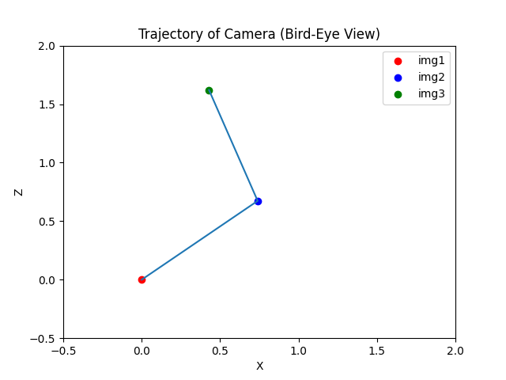

# 6DoF  Pose Estimation of Camera
## Obtained Results
```
        ---- 6DoF pose of the camera ----

        In img1:

        X: 0.0    Y: 0.0    Z: 0.0

        Roll: 0.0     Pitch: 0.0    Yaw: 0.0

        --------------
        
        In img2:

        X: 0.7393371168618282    Y: -0.005784429253495803    Z: 0.673310602923087

        Roll: -0.06574093010442929     Pitch: 1.1065619737955403    Yaw: 0.04094146510104182

        --------------
        
        In img3:

        X: 0.42927793102125156    Y: -0.08611334735230611    Z: 1.620628166463927

        Roll: -0.5889868810910622     Pitch: 12.658803713602088    Yaw: -0.35130074930551536

```
## Trajectory of the Camera


## Steps
1) Calibrating camera with given 2D-3D correspondences.
2) Detecting keypoints in img1 to track among frames using FAST detector.
3) Tracking keypoints from img1 to img2 via optical flow. Lost features are eliminated.
4) Getting essential matrix using keypoints from two frames and camera intrinsics.
5) Getting pose of camera in img2 w.r.t img1.
6) Tracking keypoints from img2 to img3 via optical flow. Lost features are eliminated.
7) Getting essential matrix using keypoints in two frames and camera intrinsics.
8) Getting pose of camera in img3 w.r.t img1.
9) Plot the bird-eye view camera trajectory and save results.


## Notes

*  Since the camera is looking towards to the z axis, yaw rotates the camera, pitch turns the camera to the left and right, and roll is up and down movement of the camera. 
*  I've got slightly different fx, fy values and 1.00038 re-projection error after calibration. I assume that's because of lack of data.

